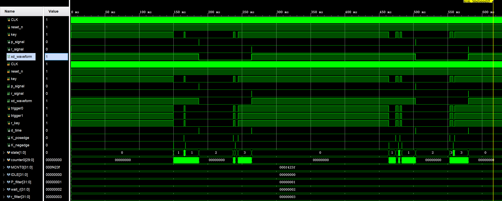

# Key Debounce Module

## 功能
- 消除机械按键的抖动
- 输出按键按下脉冲 p_signal
- 输出按键释放脉冲 r_signal
- 输出滤波后的波形 xd_waveform

## 设计思路
- 4状态状态机：IDLE -> P_filter -> wait_r -> r_filter -> IDLE
- 滤波时间：20ms（50MHz时钟，计数值1_000_000）
- 亚稳态处理：三级触发器同步异步输入信号
- 边沿检测：生成干净的上升沿和下降沿信号

## 状态转移说明
IDLE：空闲状态，检测到下降沿后进入P_filter

P_filter：按下滤波状态，计时20ms。如果期间检测到上升沿（抖动），则回到IDLE；如果计时满20ms，说明按键稳定按下，输出p_signal脉冲，进入wait_r

wait_r：等待释放状态，检测到上升沿后进入r_filter

r_filter：释放滤波状态，计时20ms。如果期间检测到下降沿（抖动），则回到wait_r；如果计时满20ms，说明按键稳定释放，输出r_signal脉冲，xd_waveform恢复高电平，回到IDLE

## 验证方法
- 仿真模拟真实按键抖动（随机抖动脉冲）
- 观察xd_waveform滤波前后对比
- 观察p_signal和r_signal脉冲输出

## 文件说明
- Key_xd.v：按键消抖模块
- Key_xd_tb.v：仿真testbench

## 仿真波形

